# Mere

A graph-first browser and knowledge workbench. Your browsing history and content
are nodes in a spatial graph; html pages, gemini capsules, local media, and notes
sit side by side in the same canvas, connected by user-created and inferred
relationships. The graph (the *orrery*) is the root surface; everything else
(tiles, panes, content cards) is a projection of it.

<p align="center">
  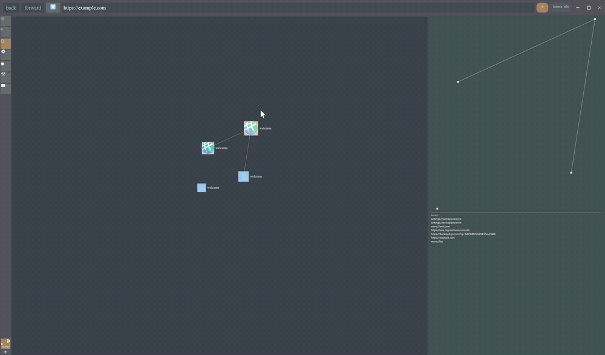<br>
  <sub>The orrery is a live force-directed graph; nodes settle under physics as you browse.</sub>
</p>

<table>
  <tr>
    <td width="50%">
      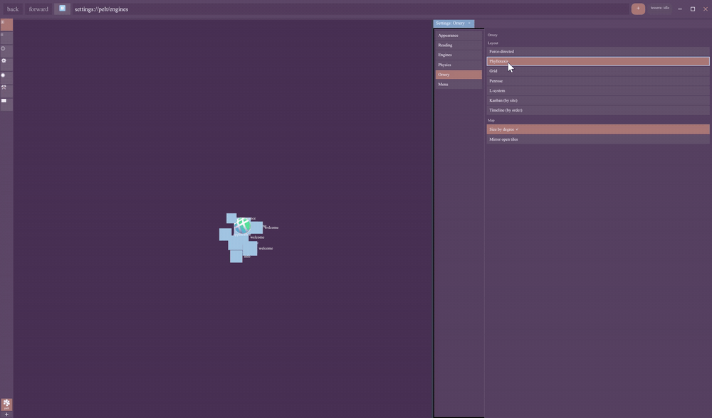<br>
      <sub>Switch the orrery between layout strategies: force-directed, grid, Penrose, L-system, kanban, timeline.</sub>
    </td>
    <td width="50%">
      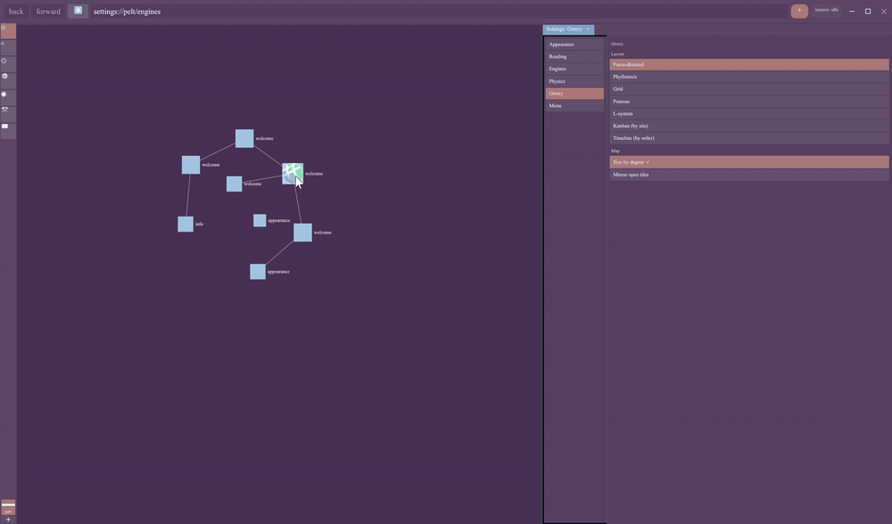<br>
      <sub>Recolor the whole shell with palette and live color-harmony controls.</sub>
    </td>
  </tr>
</table>

This repository is a Cargo workspace of 60 member crates organized by concern.
(That count is the `[workspace] members` list; the `probes` directory in
`[workspace.exclude]` is not a member and is not counted.)
The on-screen host is the `meerkat` binary; most other crates are libraries it
composes. This is pre-release, AI-assisted development; many crates are partially implemented and
some capabilities exist in code but are not yet wired into the live host.

**Made with AI**

License: Mozilla Public License 2.0 (see `LICENSE-MPL`).

## What it is

- A spatial browser: the primary surface is a force-directed graph canvas where
  each node is a page or piece of content and edges are relationships.
- Protocol-agnostic: a Gemini node and an HTTP node can live in the same graph
  and be navigated through the same interface. HTML rides a Servo-derived engine
  lane (`genet`); smolweb protocols (gemini, gopher, finger, spartan, nex,
  guppy, titan) ride the in-repo `nematic` engine and the `errand` transport.
- A composable workbench: tabs become tiles in nested split trees, projected
  from the graph.
- Built toward private local memory (`eidetic`), peer-to-peer comms (`murm`),
  and community/federation (`moot` / `moothold`) over an event-DAG substrate
  (p2panda).

The durable architecture is a composition spine: graph truth (`kernel`) is
arranged by `forme`, projected into a presentation plan by `platen`, realized as
surfaces, and backed per-surface by a content engine selected by `inker`. The
host (`meerkat`) renders the result and composites it.

## The stack's technical architecture

The whole stack is arenas for ownership, id-linked trees for structure,
and delta streams for change, repeated at every layer
from the JS heap (forked Nova) up to the orrery graph.
Have a look at Cambium, the Genet-native GUI toolkit hosted in its own
repository, too.
Up and down the stack, this pattern repeats:  
- Identity is an index, not an address.
- Meaning is a kind, not a class.
- Structure is explicit id-valued edges/links, ordered where semantic (in), indexed where derived (out).
- Everything else is kind-dependent data in a table picked by the kind.
- Change is a recorded delta stream against the tables,
- and every downstream layer is an incremental fold over that stream.

## Screenshots

<table>
  <tr>
    <td width="50%">
      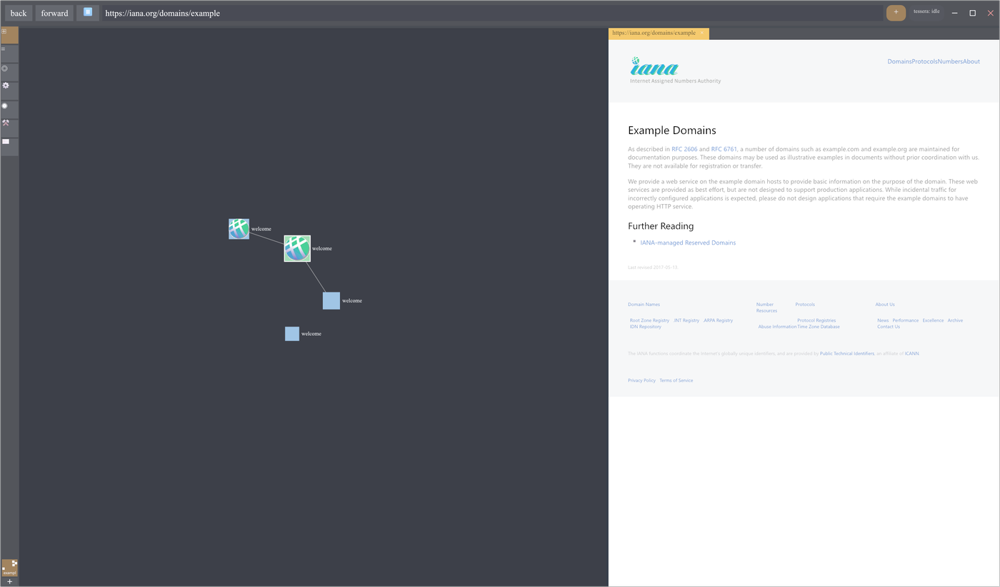<br>
      <sub>Graph and page side by side: the orrery on the left, an HTML node rendered as a tile on the right.</sub>
    </td>
    <td width="50%">
      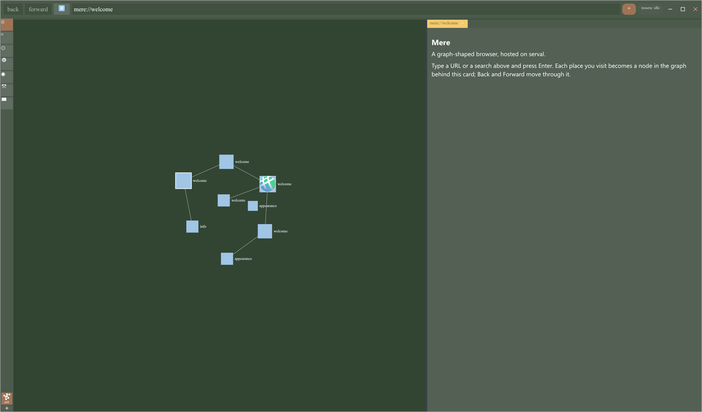<br>
      <sub>Open Mere on the welcome card; your graph builds up behind it as you browse.</sub>
    </td>
  </tr>
  <tr>
    <td width="50%">
      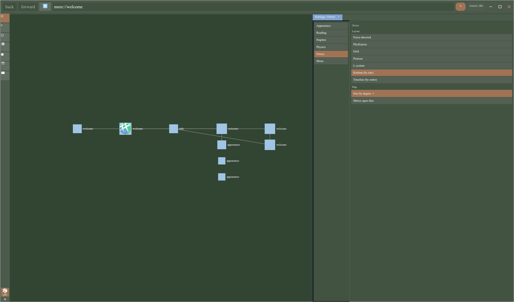<br>
      <sub>Arrange the orrery with deterministic layouts: force-directed, grid, Penrose, L-system, kanban by site, timeline by order.</sub>
    </td>
    <td width="50%">
      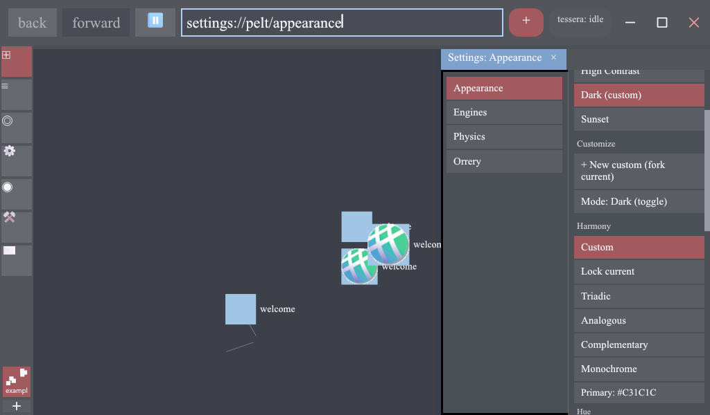<br>
      <sub>Theme the whole shell. Pick a palette or build your own with color-harmony controls (here, Sunset).</sub>
    </td>
  </tr>
</table>

## Toolchain

- Rust edition 2024. `meerkat` declares `rust-version = "1.92.0"`.
- The workspace pulls several sibling repositories as git dependencies on the
  `mark-ik/*` GitHub org (`genet`, `netrender`, `netfetcher`, `errand`,
  `wgpu-scry`). A plain `cargo build` fetches them; no local sibling checkouts
  are required. A local checkout, if present, is picked up via a gitignored
  `.cargo/config.toml` `[paths]` override.
- The root `[patch.crates-io]` redirects `stylo`, `stylo_atoms` (to the
  `servo/stylo` git rev `8bde0e96`, the v0.18.0 release tag), and `taffy` /
  `ipc-channel` (to forks
  vendored in the `mark-ik/genet` repo, tracked by branch) so the Stylo/taffy
  stack unifies with genet rather than conflicting.

## Build, run, test

```sh
# Build the whole workspace
cargo build

# Run the host shell (the Mere window)
cargo run -p meerkat

# Run the standalone graph canvas on its own window
cargo run -p orrery

# Test the whole workspace
cargo test

# Test a single crate (faster while iterating)
cargo test -p kernel
```

There are two `[[bin]]` targets in the workspace:

- `meerkat` (`crates/meerkat`): the full Mere host. A winit window that draws one
  shell document (chrome plus folded panes plus orrery node-cards) through
  genet, composites the orrery graph scene and content cards beneath it, and
  presents via netrender.
- `orrery` (`crates/orrery/orrery`): a thin winit shell over the reusable
  `Orrery` graph field-canvas, kept launchable on its own for development and
  testing. meerkat hosts the same `Orrery` as a content root.
  Will likely become the seed of a thin wasm client for browser extension targets.

`meerkat` has an `agent-harness` feature for automation/testing.

## Workspace layout

The workspace is grouped into supercrate directories under `crates/`, each owning
a single concern. Crate leaf names dropped their `mere-*` / role prefixes in a
2026-05-19 naming pass, so the directory path disambiguates (for example the
graph kernel's package name is `kernel`, at `crates/graph/graph-kernel`).

| Directory | Package(s) | Role |
|---|---|---|
| `crates/meerkat` | `meerkat` (bin + lib) | The Mere host shell: winit window, chrome (toolbar / omnibar / command palette / frametree), panes, constellation actors, content cards, present stack |
| `crates/armillary` | `armillary` | Host-neutral actor-kernel runtime: the `!Send` host-kernel boundary plus the `Send` actor harness the subsystem constellation is built on |
| `crates/graph` | `kernel`, `linked-data`, `node-lineage` | Graph truth: the identity/authority/mutation kernel, the RDF/JSON-LD ingest-export and SPARQL bridge, and per-node navigation lineage |
| `crates/orrery` | `orrery` (bin + lib), `mere-orrery`, `arrangements`, `cartography`, `gyre`, `aether` | The spatial graph view: the graph field-canvas host, its a11y/uxtree projection, deterministic layout strategies, non-destructive projection, rapier-backed physics, and the field algebra that feeds the physics |
| `crates/shell` | `chrome`, `comms`, `frame` | Host-neutral domain models: chrome view-models, the comms pane model, and the frame (split-tree) model |
| `crates/system` | `session-runtime`, `shell-state`, `proofs`, `ux-events`, `registry/register-*` | Runtime services: session settings/manifest, shell state, typed proof and content-reference vocabulary, the UX event/probe taxonomy, and the capability registries (diagnostics, input, knowledge, layout, lens, mod-loader, protocol, theme, viewer) |
| `crates/inker` | `inker`, `document-canvas`, `engines/nematic`, `engines/scrying-engine` | Engine selection and content rendering: the engine controller, the parley-based document canvas, the smolweb engine, and the system-WebView scrying engine seam |
| `crates/forme` | `forme`, `uxtree` | Per-graph-view workbench arrangement authority and the UX-tree projection |
| `crates/platen` | `platen`, `domain/apparatus`, `domain/gloss`, `domain/workbench` | Composition surface: compiles arrangements into presentation plans, plus the domain panels (apparatus inspector, gloss navigator, tiled workbench) |
| `crates/eidetic` | `eidetic` (`eidetic-core`), `eidetic-fjall`, `eidetic-https-fetcher`, `eidetic-iroh-fetcher`, `eidetic-search` | Durable private local memory: the typed-payload store vocabulary, the fjall backend, HTTPS and iroh fetchers, and the tantivy/BM25 lexical search index |
| `crates/import` | `import` | Browser-data import: bookmark / history / session models and Chrome-JSON / Netscape-HTML parsers, producing portable page seeds |
| `crates/intel` | `embed` | Local intelligence: the embedding-provider trait and vector index over eidetic artifacts (pure-Rust, with a future Burn-backed provider slot) |
| `crates/murm` | `murm`, `murm-replication`, `transport` | Peer exchange: direct conversation, the native conversation engine and signed grammar, shared p2panda replication over muniment, and Iroh-based transport |
| `crates/moot` | `moothold`, `mooting` | Governed community spaces: Moot event grammar, roster, tessera, constitution primitives, and recognition policy over `murm-replication` |
| `crates/mesh` | `mesh` | The personal-space compute mesh: signed job operations over LogSync, a deterministic job board and worker loop, plus policy-bound retention checkpoints and prunable event history |
| `crates/persona` | `identity`, `gazetteer` | Persona identity and handle resolution: master Ed25519 keypair, OS-keychain integration, per-protocol identity derivation, and WebFinger today |
| `crates/script` | `script-rhai` | The Rhai backend for the block-evaluator lane (pure Rust, sandboxed); the privileged omnibar command shell layers verb bindings on top |
| `crates/probes` | (excluded) | Spike/probe crates; referenced in `[workspace.exclude]` and not product crates. The directory is not present in the repo today |

## The printing-press metaphor

The data flow runs in two threads:

- Per-node content production: engines (`genet` for HTML, `nematic` for smolweb,
  the scrying engine for system WebViews) produce content; `inker` selects and
  orchestrates the engine and routing for each node.
- Per-graph-view arrangement: graph truth (`kernel`) is locked into an
  arrangement by `forme`; `platen` presses that arrangement into surface/pane
  output, which the host composites.

`eidetic` keeps impressions over time as content-addressed memory; `node-lineage`
records per-owner navigation history. The name *verso* survives only as the
designation for the engine-flip / compatibility-view seam; its crates were
retired in 2026-06.

## In-product vocabulary

The community tiers are *orrery* (a user's root graph view) → *moot* (a themed,
federatable graph-view community) → *moothold* (a holding of moots) → *coalition*
(a sovereign cluster of mootholds). Other terms: *engram* (a portable durable
memory unit), *flora* (a moot's accumulated engrams), *kith / kin* (contact
tiers), *tessera* (a trust/contribution token), *eidetic* (private local memory).

## Key dependency pins

Set once in `[workspace.dependencies]` and consumed via `dep.workspace = true`:

- Linebender visual stack: `vello` 0.9, `wgpu` 29, `kurbo` 0.13, `peniko` 0.6,
  `parley` 0.10, `skrifa` 0.42, `color` 0.3.
- Input / windowing / a11y: `winit` 0.30.13, `accesskit` 0.24,
  `accesskit_windows` 0.32, `accesskit_unix` 0.21, `accesskit_macos` 0.26,
  `ui-events` 0.3, `raw-window-handle` 0.6, `dpi` 0.1.2.
- Cross-cutting: `tracing` 0.1, `serde` 1, `serde_json` 1, `uuid` 1.

`unsafe_code` is a workspace lint set to `warn`, and `clippy::all` is set to
`warn`.

## Relationship to sibling repositories

Mere consumes several sibling repos one-way (it depends on them; they never
depend on Mere):

- `genet` (`mark-ik/genet`): the Servo-derived web engine and host layer.
  Mere uses `xilem-serval`, `genet-scripted-dom`, `genet-static-dom`,
  `genet-layout`, `genet-winit-host`, `pelt-core`, `pelt-desktop`, and
  `layout-dom-api` from it. The `taffy` and `ipc-channel` forks are vendored
  here and patched in.
- `netrender` (`mark-ik/netrender`): the renderer (`netrender`,
  `paint_list_render`, `paint_list_api`, `netrender_text`).
- `netfetcher` (`mark-ik/netfetcher`): off-thread WHATWG Fetch for http(s).
- `errand` (`mark-ik/errand`): smolweb transport (gemini / gopher / finger /
  spartan / nex / guppy / titan).
- `wgpu-scry` (`mark-ik/wgpu-scry`): the Windows WebView2 compositing producer
  for the scrying tile (a `cfg(windows)` dependency of `meerkat`).

## Documentation

Authoritative project documentation lives under `design_docs/`. Start with
`design_docs/DOC_README.md` (the index) and follow its required reading order:
`DOC_POLICY.md`, `TERMINOLOGY.md`, the lexicon brief, and the external-deps
topology brief. Recent foundational docs include the composition spine
(`mere_docs/technical_architecture/2026-05-21_mere_composition_spine.md`), the
statement-kernel brief (2026-06-19), and the interaction-model spine
(2026-06-18). Per-crate areas (`eidetic_docs/`, `inker_docs/`, `murm_docs/`,
`nematic_docs/`, `moothold_docs/`, `verso_docs/`) hold their own plans.

## Status

Pre-1.0 development. The graph canvas, chrome shell, smolweb and HTML content
lanes, session persistence, comms pane, and the SPARQL query lane are
implemented to varying degrees; p2p sync, federation, local intelligence, and
the unified-document-host work are in progress or partially wired. Several design
docs note capabilities that exist in code but are not yet on the live host path.
Crate versions are pinned at `0.0.1` and binaries are `publish = false`.

## More screenshots

<table>
  <tr>
    <td width="50%">
      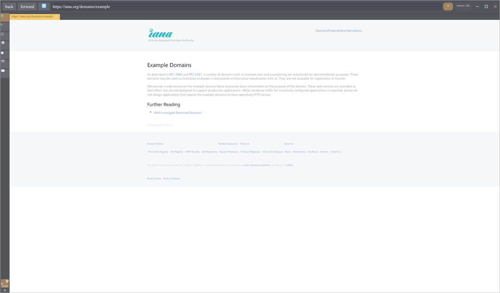<br>
      <sub>The web lane: a full HTML page rendered in a tile by the genet engine.</sub>
    </td>
    <td width="50%">
      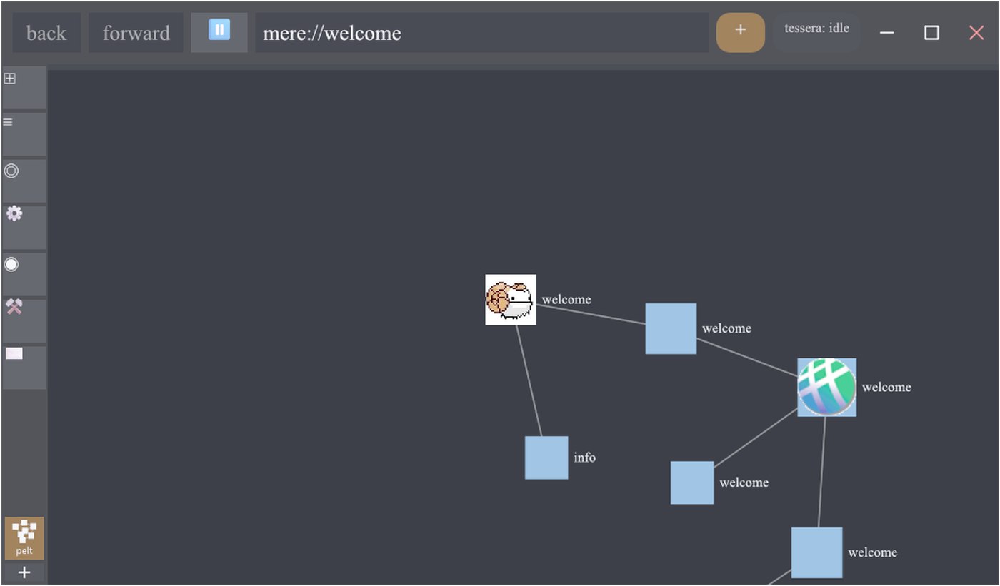<br>
      <sub>The graph fills out as you browse; nodes carry their site's favicon.</sub>
    </td>
  </tr>
  <tr>
    <td width="50%">
      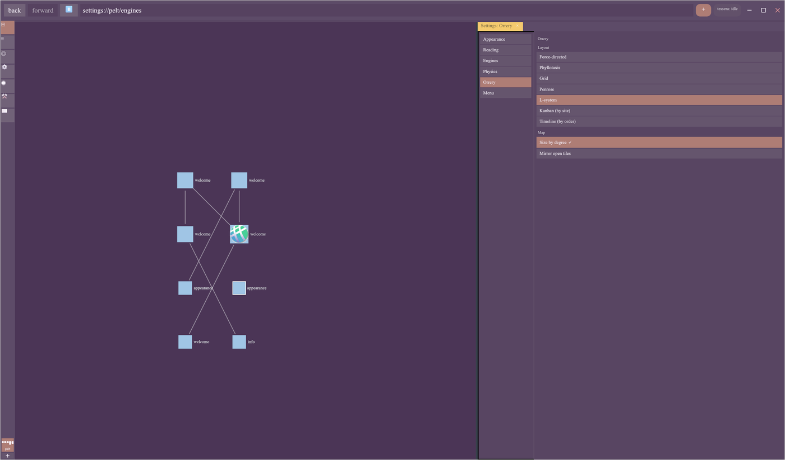<br>
      <sub>The same graph under a different layout (L-system) and the Sunset theme.</sub>
    </td>
    <td width="50%">
      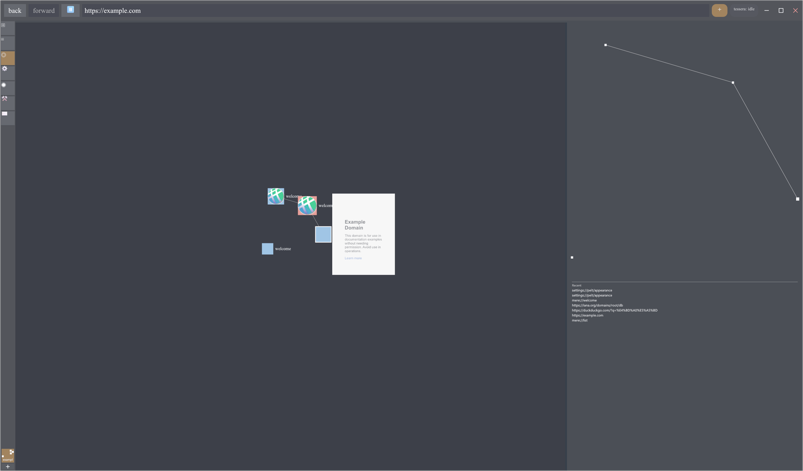<br>
      <sub>A recent-pages list and a history mini-map track your navigation lineage beside the graph.</sub>
    </td>
  </tr>
</table>

<table>
  <tr>
    <td width="50%">
      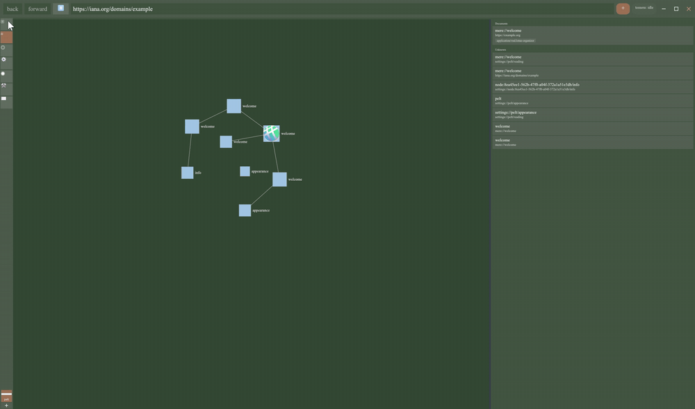<br>
      <sub>Inspect any node: identity, provenance, and fetch and parse state.</sub>
    </td>
    <td width="50%">
      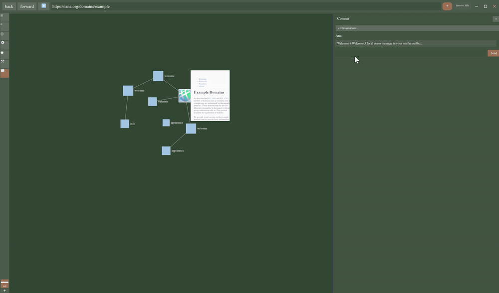<br>
      <sub>Every action lives in one command menu: relate nodes, export JSON-LD, open a selection in splits, and more.</sub>
    </td>
  </tr>
</table>

## License

Mozilla Public License 2.0. See `LICENSE-MPL`.
