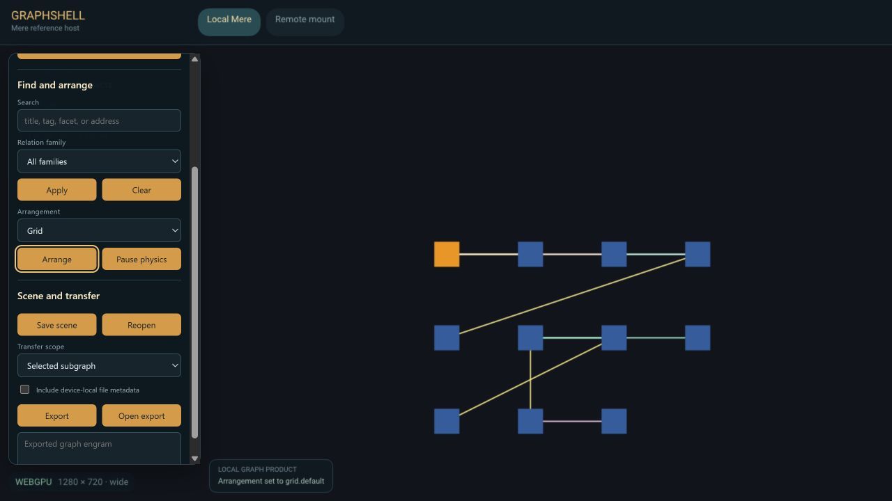

# Mere

Mere is the library behind a graph-first browser. History and content become
nodes in a spatial graph: HTML pages, gemini capsules, local media, and notes
sit side by side in one canvas, joined by user-made and inferred relationships.
Mere composes graph truth, arrangement, persistence, retrieval, identity, and
comms, then hands the result to a host. The graph (the *orrery*) is the root
surface; tiles, panes, and content cards are projections of it.

<p align="center">
  <br>
  <sub>Graphshell, Mere's reference host: a local graph arranged through the product's own search, relation, and scene controls.</sub>
</p>

This repository is a Cargo workspace of 83 members, plus the `crates/probes`
directory in `[workspace.exclude]`. Reusable crates live under `crates/`;
runnable ports live under `ports/`. Ports may depend on crates; crates do not
depend on ports (`scripts/check_port_boundaries.py` checks this).
[Turnstone](https://github.com/merely-made/turnstone), the browser host, is a
separate repository that consumes Mere.

This is pre-release, AI-assisted development. Many crates are partially
implemented, and some capabilities exist in code but are not yet wired into a
host.

**Made with AI**

License: MIT OR Apache-2.0 (see `LICENSE-MIT` and `LICENSE-APACHE`).

## What it is

- A spatial browser: the primary surface is a graph canvas where each node is a
  page or piece of content and edges are relationships.
- Protocol-agnostic: a gemini node and an HTTP node live in the same graph and
  navigate through the same interface. `http(s)` runs through genet's
  `netfetcher`; `gemini`, `gopher`, `finger`, `spartan`, `nex`, `guppy`, and
  `titan` run through genet's `errand` transport and `nematic` engine.
- A composable workbench: tabs become tiles in nested split trees, projected
  from the graph.
- Built toward private local memory (`eidetic`), peer exchange (`murm`), and
  community federation (`moot` / `moothold`) over a p2panda event DAG.

The composition spine: graph truth (`mere-kernel`) is arranged by `mere-forme`,
compiled into a presentation plan by `platen`, projected by `mere-cartography`,
and painted by `mere-canvas`. Per-node content is produced by an engine that
genet's `inker` selects and routes. The host composites the result.
`mere-eidetic` keeps content-addressed memory over time; `mere-trail` projects
per-owner navigation history.

## The facade crate

`crates/mere` is the curated surface downstream hosts depend on. It re-exports
member crates behind capability features and adds one module of its own,
`mere::routing` (`ENGINE_GRAPHSHELL_INTERNAL`, `ENGINE_LINKED_DATA_INGEST`,
`is_graph_contribution_route`, `route_policy`).

| Feature | Default | Re-exports |
|---|---|---|
| `graph` | yes | `forme`, `graphlets`, `glossary`, `kernel`, `roster`, `trail` |
| `linked-data` | yes | `linked_data` (JSON-LD import/export) |
| `canvas` | yes | `canvas`, `gloss` |
| `workbench` | yes | `apparatus`, `platen`, `workbench`, and genet's `inker` |
| `query` | no | enables `linked-data/query` (SPARQL over the projected quads) |
| `fixtures` | no | enables `kernel/fixtures` |

## Workspace layout

Crates are grouped into supercrate directories, each owning one concern. Many
packages carry a `mere-` prefix on crates.io while the workspace exposes an
unprefixed alias via Cargo's `package =` field, so `mere-kernel` is written
`kernel.workspace = true` by consumers. The table gives the package names as
declared.

| Directory | Packages | Role |
|---|---|---|
| `crates/mere` | `mere` | The facade crate described above |
| `crates/incipit` | `incipit` | `GraphId` and `SessionId`, the two ids shared across the stack, with no dependency on the graph |
| `crates/graph` | `mere-kernel`, `mere-glossary`, `graphlets`, `mere-linked-data` | Graph truth: the identity/authority/mutation kernel, djot-outline and metrics digests, graphlet derivation and shape classification, and the JSON-LD/RDF bridge with its optional SPARQL evaluator |
| `crates/canvas` | `mere-canvas` (lib `canvas` + bin `canvas`), `mere-cartography`, `arrangements` | The graph canvas content root (graph, seiche physics, camera, node-children pool, scene-paint underlay), the non-destructive projection layer (`LayoutStrategy`, `Projection`, `Overlay`, `MinimapDescriptor`), and the deterministic `Layout<N>` catalog (penrose, l-system, phyllotaxis, kanban/timeline, radial, grid, semantic) |
| `crates/forme` | `mere-forme`, `uxtree` | Per-graph-view arrangement authority, and the AccessKit projection of structural elements |
| `crates/platen` | `platen`, `workbench` | Compiles forme arrangements into workbench plans, tile trees, and pane geometry; `workbench` projects the result into uxtree nodes |
| `crates/domain` | `mere-apparatus`, `mere-gloss`, `mere-roster`, `mere-trail` | UX panel vocabularies: the system-inspector strip, outline and minimap geometry, pane tabs/rows/cards, and the visit-history projection |
| `crates/shell` | `mere-chrome`, `mere-comms` | Host-neutral view models: toolbar, app menu, omnibar, window chrome; and a comms model (conversations, messages, identities, drafts) over a `ProtocolAdapter` seam with misfin and murm adapters |
| `crates/system` | `session-runtime`, `shell-state`, `content-contract`, `mere-fetch`, `mere-proofs`, `ux-events`, `luggage`, `notochord`, `registry/register-*` | Runtime services: session manifests and sidecars, shell session state, the content-worker message contract, the fetch actor and cookie runtime, typed digests and proof envelopes, the `UxEvent`/`UxObserver`/`UxProbe` taxonomy, signed-manifest self-update, owner-controlled session admission, and the capability registries |
| `crates/eidetic` | `mere-eidetic`, `mere-eidetic-fjall`, `mere-eidetic-https-fetcher`, `mere-eidetic-iroh-fetcher`, `mere-eidetic-search`, `muniment`, `codicil`, `chartulary`, `scholia` | Durable private local memory: the typed blob request/response vocabulary and store trait, the fjall backend, HTTPS and iroh fetchers, the tantivy/BM25 lexical index, the portable byte-backend seam, the append-only log, the content-addressed container graph, and its RDF projection |
| `crates/import` | `import` | Bookmark, history, and session models plus Chrome-JSON and Netscape-HTML parsers, producing portable page seeds |
| `crates/crawl` | `mere-crawl` | Host-neutral crawl frontier and bounded crawl runtime |
| `crates/intel` | `esp`, `mere-embed`, `mere-signals`, `vates`/`sibylla` compatibility shims | Portable generation and embedding seams under `esp::infer` and `esp::embed`, their feature-gated Burn backends, exact vector retrieval, Mere's eidetic/quint glue, and graph-structural signal extraction |
| `crates/conatus` | `numen`, `quint`, `seiche` | The portable physics stack: field definitions as data, evaluation, integration |
| `crates/scenograph` | `sceno`, `scenomise`, `scenotime`, `scenograph` | The projection engine: scene and score contracts, choreography, the incremental runtime, and a re-export facade |
| `crates/graphshell` | `graphshell-protocol`, `-client`, `-endpoint`, `-stdio`, `-local`, `-network` | The reusable remote-session stack: versioned carrier-neutral messages and the `Carrier` trait, the client state machine, injected projection/intent traits for applications, and three carriers (child-process stdio, in-process, byte stream) |
| `crates/stickleback` | `stickleback` | The replicated-space runtime beneath every signed peer domain: joined p2panda spaces, policy-before-insert processing, muniment-backed operation storage, checkpoints, retention, and drop carriage. Domains supply grammar, addressing, and authorization |
| `crates/murm` | `murm`, `mere-transport` | Direct peer conversation, over iroh QUIC. A `reticulum` feature adds a `retinue` radio backend |
| `crates/moot` | `commons-spine`, `gemot`, `moothold`, `mooting` | Governed community spaces: the chartulary-graph-as-replicated-domain profile, the Moot lifecycle and governance layer with Tessera, tier-3 federation, and the social-primitives protocol core |
| `crates/mesh` | `mere-mesh` | The personal-space compute mesh: signed job operations over LogSync, a deterministic job board, and the worker loop |
| `crates/dramatis` | `personae`, `mere-persona-picker`, `gazette`, `gaz` | The cast list (dramatis personae): the trust-plane spine (master Ed25519 keypair, BLAKE3 per-protocol derivation, OS-store-unlocked vault, sealed records), the persona picker view, the handle-resolution index (WebFinger today), and stored key-rooted contacts |
| `crates/servitor` | `servitor` | The resident-helper unit: a denizen holds a scoped structural capability and proposes changes through a validating, revision-checked gate |
| `crates/armillary` | `armillary` | The host-neutral actor-kernel runtime: the `!Send` host-kernel boundary, the `Send` actor harness, generation counters, and a reusing worker pool |
| `crates/script` | `script-rhai`, `document-host`, `app-host` | Scripting hosts: the Rhai `BlockEvaluator` backend, the Wasmtime `document-core` host over genet's live `ScriptedDom`, and the Wasmtime `app-core` envelope host over a host-supplied `ActionSink` |
| `crates/probes` | (excluded) | Spike crates listed in `[workspace.exclude]` |

Nine component families were separate sibling repositories until the 2026-07-23
consolidation: `personae`, `armillary`, the eidetic memory primitives
(`muniment`, `codicil`, `chartulary`, `scholia`), `servitor`, Vates and Sibylla,
the conatus physics stack, the scenograph family, the graphshell session crates,
and the Graphshell port. Vates and Sibylla were subsequently consolidated as
`esp::infer` and `esp::embed`; their old packages remain compatibility shims.

## Ports

| Directory | Packages | Role |
|---|---|---|
| `ports/graphshell` | `graphshell` (lib + receipt/host bins), `graphshell-web` (`cdylib`) | Mere's reference graph host and remote-projection client. Two capability profiles: `native` (default) carries admitted sessions, transports, Personae composition, and the receipt binaries; `web` selects Mere's portable graph and canvas facade for `wasm32-unknown-unknown`. `graphshell-web` is the browser presenter, built on Mere Canvas, Cambium, and NetRender over WebGPU |
| `ports/knot` | `knot` (bins `knot_endpoint`, `knot_sync_host`) | Files-in-place authoring endpoint |

## Toolchain and dependencies

- `rust-toolchain.toml` pins Rust 1.97.1 with the `wasm32-wasip2` target (for
  the document-core guest crates).
- Edition 2024 across the workspace, except `document-host`, `app-host`, and
  `luggage`, which are edition 2021. `document-host` and `app-host` declare
  `rust-version = "1.93.0"` for wasmtime 45; six crates (`mere`, `mere-kernel`,
  `mere-canvas`, `arrangements`, `quint`, `session-runtime`) declare `1.92.0`,
  and the rest declare none.
- Sibling repositories arrive as git dependencies on `main`:
  `merely-made/genet` (`inker`, `nematic`, `document-canvas`,
  `knot-editor-host`, `illume`, `cambium`, `scrying-engine`, `graft-engine`,
  `weld-engine`, plus `errand`, `netfetcher`, `genet-layout` and friends from
  individual crates), `merely-made/netrender` (`paint_list_api`,
  `paint_list_render`), and `merely-made/retinue` (optional). `misfin` 0.0.4
  comes from crates.io; its source lives in `merely-made/smolweb`.
- A plain `cargo build` fetches all of them. A local sibling checkout, if
  present, is picked up through a gitignored `.cargo/config.toml` carrying
  per-source `[patch]` tables.
- The root `[patch.crates-io]` redirects `taffy`, `stylo_taffy`,
  `layout-dom-api`, `genet-scripted-dom`, and `ipc-channel` onto genet's forks;
  the p2panda family onto `mark-ik/p2panda` (the dalek 3 port);
  `boa_engine`/`boa_gc` onto `mark-ik/boa` branch `genet`; and
  `iroh-mdns-address-lookup` and `swarm-discovery` onto `mark-ik` forks. The
  reasoning for each is in the manifest comments.

Load-bearing pins are set once in `[workspace.dependencies]` and consumed with
`dep.workspace = true`:

- Linebender visual stack: `vello` 0.9, `wgpu` 29, `kurbo` 0.13, `peniko` 0.6,
  `parley` 0.10, `skrifa` 0.42, `color` 0.3.
- Input, windowing, a11y: `winit` 0.30.13, `accesskit` 0.24,
  `accesskit_windows` 0.32, `accesskit_unix` 0.21, `accesskit_macos` 0.26,
  `ui-events` 0.3, `raw-window-handle` 0.6, `dpi` 0.1.2.
- Cross-cutting: `tracing` 0.1, `serde` 1, `serde_json` 1, `uuid` 1,
  `tinct` =0.1.2 (aliased `tincture`), `base64` 0.22, `blake3` 1.

`unsafe_code` and `clippy::all` are workspace lints set to `warn`.

## Build, run, test

```sh
# Build the whole workspace
cargo build

# Test the whole workspace
cargo test

# Test a single crate (use the package name, not the workspace alias)
cargo test -p mere-kernel

# Run the standalone graph canvas in its own window
cargo run -p mere-canvas --features native-present --bin canvas
```

`ports/graphshell` has no default binary. Pick one explicitly, for example
`cargo run -p graphshell --bin g1_receipt -- ports/graphshell/docs/receipts/g1_loopback.html`.
The browser presenter is built to wasm and served; both flows, along with the
receipt commands, are in [`ports/graphshell/README.md`](ports/graphshell/README.md).

Turnstone lives in the sibling `merely-made/turnstone` repository, pulls `mere`
as a git dependency, and is run there.

## In-product vocabulary

Community tiers run *orrery* (a user's root graph view) to *moot* (a themed,
federatable graph-view community) to *moothold* (a holding of moots) to
*coalition* (a sovereign cluster of mootholds). Also: *engram* (a portable
durable memory unit), *flora* (a moot's accumulated engrams), *kith / kin*
(contact tiers), *tessera* (a trust and contribution token), *eidetic* (private
local memory).

## Documentation

Authoritative project documentation lives under `design_docs/`. Start with
[`design_docs/DOC_README.md`](design_docs/DOC_README.md) and follow its required
reading order: `DOC_POLICY.md`, `TERMINOLOGY.md`, the lexicon brief
(`2026-05-04`), and the external-deps topology brief (`2026-05-24`).

Foundational architecture docs include the composition spine
(`mere_docs/technical_architecture/2026-05-21_mere_composition_spine.md`), the
statement-kernel brief (`2026-06-19`), the interaction-model spine
(`2026-06-18`), and the data-oriented doctrine brief
(`design_docs/2026-07-02_data_oriented_doctrine_brief.md`), which covers the
identity-as-index, meaning-as-kind, delta-stream pattern the stack repeats at
every layer. Per-area directories (`eidetic_docs/`, `inker_docs/`, `murm_docs/`,
`nematic_docs/`, `moothold_docs/`, `verso_docs/`) hold their own plans.

## Status

Pre-1.0. The graph canvas, chrome shell, smolweb and HTML content lanes,
session persistence, comms pane, and the SPARQL query lane are implemented to
varying degrees. Peer sync, federation, local intelligence, and the
unified-document-host work are in progress or partially wired. Several design
docs note capabilities that exist in code but are not yet on the live host path.

Crate versions vary. The workspace default is `0.0.1`; crates published to
crates.io carry their own (for example `muniment` 0.1.1, `chartulary` 0.2.0,
`seiche` 0.0.4). Crates that are not published set `publish = false`.

## License

Licensed under either of MIT (`LICENSE-MIT`) or Apache-2.0 (`LICENSE-APACHE`)
at your option.
